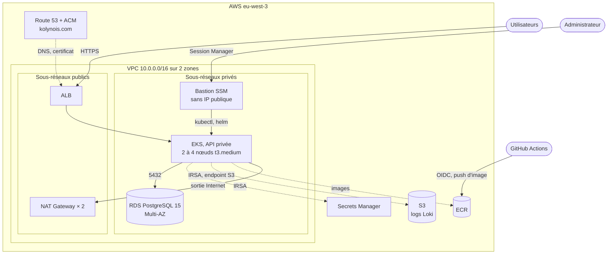

# aws-infra — Infrastructure AWS de Veille Immobilière

Code Terraform de toute l'infrastructure de production, dans la région **eu-west-3 (Paris)** : réseau, cluster Kubernetes, base de données, registre d'images, DNS et TLS, identités IAM et accès d'administration.

| Dépôt | Rôle |
|---|---|
| [flask-app](https://github.com/Styyde/flask-app---public-veille-immobiliere) | Code applicatif, image Docker, CI/CD — **README principal** et architecture d'ensemble |
| [flask-gitops](https://github.com/Styyde/flask-gitops---public-veille-immobiliere) | Ce qui tourne dans le cluster (Helm, Argo CD) |
| **aws-infra** *(ce dépôt)* | L'infrastructure qui l'héberge |

## Sommaire

- [Architecture](#architecture)
- [Sécurité](#sécurité)
- [Haute disponibilité](#haute-disponibilité)
- [Intégration continue](#intégration-continue)
- [Déploiement](#déploiement)
- [Limites connues](#limites-connues)

## Architecture



| Domaine | Ressources |
|---|---|
| Réseau | VPC `10.0.0.0/16` sur `eu-west-3a` et `eu-west-3b`, 2 sous-réseaux publics et 2 privés, une NAT Gateway par zone, endpoint S3 de type gateway (images ECR et logs sans passer par le NAT) |
| Kubernetes | EKS 1.33 à API privée ; node group `application-workers` (t3.medium, Amazon Linux 2023, 2 à 4 nœuds) ; addon EBS CSI |
| Base de données | RDS PostgreSQL 15, `db.t4g.micro`, stockage gp3 chiffré de 20 Go extensible à 50 Go, Multi-AZ |
| Images | Dépôt ECR `veille-immo-api` : scan à chaque push, conservation des 5 dernières images |
| DNS et TLS | Zone Route 53 `kolynois.com` existante ; certificat ACM `amandal.kolynois.com` + `*.kolynois.com` validé par DNS |
| Secrets | Secrets Manager : connexion à la base, admin Grafana, webhook Slack |
| Identités | Fournisseur OIDC pour GitHub Actions ; un rôle IRSA par composant du cluster |
| Logs | Bucket S3 de Loki : privé, chiffré, purgé après 30 jours |
| Administration | Bastion SSM dans un Auto Scaling Group |

Organisation du code : ressources dans `main.tf` (bastion dans `bastion.tf`), paramètres dans `variables.tf` et `terraform.tfvars`, sorties dans `outputs.tf`, script de post-installation dans `scripts/bootstrap.sh.tpl`. Les modules officiels `terraform-aws-modules` sont épinglés (VPC 5.0.0, EKS 20.37.2, RDS 6.0.0) et toutes les ressources reçoivent les tags `Project`, `Environment` et `ManagedBy = Terraform`.

## Sécurité

**Réseau**

- L'**API Kubernetes est privée** (`cluster_endpoint_public_access = false`) : elle n'est joignable que depuis le VPC.
- Nœuds, base de données et bastion sont dans des **sous-réseaux privés** ; seuls l'ALB et les NAT Gateways sont publics.
- La base n'accepte le port 5432 **que depuis le security group du cluster**.

**Administration par bastion SSM**

- Aucune IP publique, **aucun port entrant**, pas de SSH : l'accès passe par AWS Systems Manager Session Manager (authentification IAM, sessions tracées dans CloudTrail).
- Le rôle du bastion est plafonné par une **permissions boundary** (connectivité SSM et `eks:DescribeCluster` uniquement) : il est administrateur *du cluster*, via une EKS access entry, mais ne peut rien créer dans *le compte AWS*.
- Le créateur du cluster ne reçoit aucun droit implicite (`enable_cluster_creator_admin_permissions = false`) : chaque accès est déclaré.

**Identités et moindre privilège**

- **GitHub Actions sans clé permanente** : le rôle n'est assumable, par OIDC, que depuis le dépôt flask-app, et ne peut que pousser dans le dépôt ECR de l'application.
- **IRSA** : chaque composant a son propre rôle, limité à ses ressources — ALB Controller, ExternalDNS (la seule zone `kolynois.com`), External Secrets (les trois secrets du projet), Cluster Autoscaler (les seuls groupes de nœuds de ce cluster), YACE (CloudWatch en lecture seule), Loki (son bucket), pilote EBS CSI.
- **IMDSv2 obligatoire** sur les nœuds et le bastion.

**Secrets et chiffrement**

- Les mots de passe sont générés par Terraform (`random_password`) et stockés dans **Secrets Manager**, où External Secrets Operator les lit. Ils ne passent jamais par Git.
- Stockage RDS et bucket S3 chiffrés ; accès public du bucket bloqué ; TLS sur l'ALB par certificat ACM.
- `.gitignore` exclut l'état Terraform, les fichiers `*.tfvars` (sauf `terraform.tfvars`, qui ne contient aucun secret) et les plans (`*.tfplan`), susceptibles de contenir des secrets en clair.

**Contrôle automatisé** : Trivy analyse la configuration Terraform à chaque push et bloque sur toute anomalie CRITICAL ou HIGH (voir [Intégration continue](#intégration-continue)).

## Haute disponibilité

| Composant | Mécanisme |
|---|---|
| Réseau | Deux zones de disponibilité ; une NAT Gateway par zone, donc pas de point unique de sortie |
| Plan de contrôle EKS | Géré par AWS, réparti sur plusieurs zones |
| Nœuds | 2 à 4 nœuds répartis sur les deux zones ; le Cluster Autoscaler ajoute des nœuds quand des pods restent en attente ; mises à jour nœud par nœud (`max_unavailable = 1`) |
| Base de données | RDS **Multi-AZ** (réplique synchrone, bascule automatique) ; sauvegardes quotidiennes conservées 7 jours ; extension automatique du stockage jusqu'à 50 Go |
| Entrée | ALB réparti sur les sous-réseaux publics des deux zones |
| Bastion | Auto Scaling Group d'une instance, recréée automatiquement (dans n'importe quelle zone) si elle tombe |

La redondance des pods (répliques, HPA, PodDisruptionBudget, anti-affinité) est décrite dans [flask-gitops](https://github.com/Styyde/flask-gitops---public-veille-immobiliere#haute-disponibilité).

## Intégration continue

`.github/workflows/ci.yml` n'effectue que des vérifications statiques, **sans aucun accès AWS** — sûres même sur une pull request externe :

| Job | Rôle |
|---|---|
| `fmt` | `terraform fmt -check` |
| `validate` | `terraform validate`, sans backend |
| `tflint` | Lint avec le ruleset AWS |
| `security-scan` | Trivy en mode `config`, bloquant sur CRITICAL/HIGH |
| `plan` | `terraform plan` publié en commentaire de pull request — **désactivé** tant que le backend distant et un rôle OIDC dédié n'existent pas (variable de dépôt `TF_BACKEND_ENABLED`) |

L'`apply` reste volontairement manuel.

## Déploiement

**Prérequis** : Terraform ≥ 1.0, AWS CLI v2 avec le plugin Session Manager, et une zone Route 53 publique `kolynois.com` dans le compte.

**1. Provisionner l'infrastructure**

```bash
terraform init
export TF_VAR_alertmanager_slack_webhook_url="https://hooks.slack.com/services/..."   # facultatif
terraform plan
terraform apply
```

Les paramètres propres au projet (dépôt GitHub autorisé à pousser des images, URL du dépôt GitOps, utilisateur de la base) sont dans `terraform.tfvars`.

**2. Installer les composants du cluster, depuis le bastion**

Le cluster étant privé, Terraform ne lance ni `kubectl` ni `helm` ; il génère un script à exécuter depuis le bastion :

```bash
terraform output -raw bootstrap_script > bootstrap.sh
aws ssm start-session --target <id-du-bastion>   # ID : voir la sortie bastion_instance_id_command
# dans la session, copier bootstrap.sh puis :
bash bootstrap.sh
```

Le script installe dans l'ordre : StorageClass `gp3` par défaut, AWS Load Balancer Controller, metrics-server, ExternalDNS, External Secrets Operator et son `ClusterSecretStore`, Cluster Autoscaler, Argo CD, puis la `root-app`, qui déploie le contenu de [flask-gitops](https://github.com/Styyde/flask-gitops---public-veille-immobiliere).

**3. Raccorder la CI de flask-app** : renseigner les secrets GitHub `AWS_ROLE_ARN` (sortie `github_actions_role_arn`), `AWS_REGION`, `ECR_REPOSITORY`, `GITOPS_REPO` et `GITOPS_PUSH_TOKEN`.

**Accès à Argo CD** (jamais exposé sur Internet) :

```bash
# Dans la session SSM du bastion
kubectl port-forward -n argocd svc/argocd-server 8080:443 --address 0.0.0.0

# Depuis le poste local, dans un second terminal
aws ssm start-session --target <id-du-bastion> \
  --document-name AWS-StartPortForwardingSession \
  --parameters '{"portNumber":["8080"],"localPortNumber":["8080"]}'
# puis ouvrir https://localhost:8080
```

**Sorties principales**

| Sortie | Usage |
|---|---|
| `bootstrap_script` | Script d'installation des composants du cluster |
| `bastion_instance_id_command` | Commande qui donne l'ID courant du bastion |
| `github_actions_role_arn` | Secret `AWS_ROLE_ARN` de la CI de flask-app |
| `ecr_repository_url`, `loki_role_arn`, `loki_logs_bucket_name`, `yace_role_arn`, `grafana_admin_secret_name`, `alertmanager_slack_secret_name` | Valeurs reportées dans flask-gitops |

## Limites connues

- **État Terraform local** : le backend S3 avec verrou DynamoDB est prêt dans `backend.tf` mais commenté. En attendant, l'état — qui contient les mots de passe générés — n'est ni partagé, ni verrouillé, ni sauvegardé.
- L'installation des composants du cluster reste une étape manuelle (script de bootstrap).
- Coût permanent : deux NAT Gateways, RDS Multi-AZ et plan de contrôle EKS. Pour un environnement hors production, `db_multi_az = false` divise par deux le coût de la base.
- Le domaine `kolynois.com` est aussi écrit en dur dans le filtre ExternalDNS du script de bootstrap.
